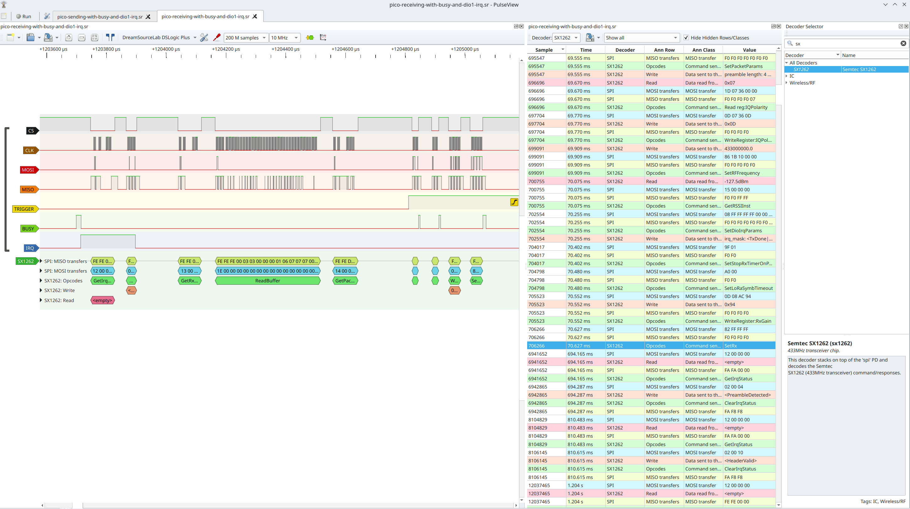

#+STARTUP: inlineimages
* SX1262 LoRa module decoder

This is a decoder for the Semtech SX1262 LoRa module protocol for the
[[https://sigrok.org/wiki/Libsigrokdecode][libsigrokdecode]] library.

** Installation

Copy or link the =sx1262= to a location =libsigrokdecode= picks up. For example
under Linux this is

#+begin_src bash
.local/share/libsigrokdecode/decoders
#+end_src

Then it can be used in =sigrok-cli= or [[https://sigrok.org/wiki/PulseView][PulseView]].

** Screenshots

** Personal notes

#+begin_src bash
# Run tests
~/software/vc/sigrok/sigrok-test/decoder/runtc -P spi -p cs=0 -p clk=1 -p mosi=2 -p miso=3 -P sx1262 -i ~/software/vc/sigrok/sigrok-dumps/spi/sx1262/sending-repeatedly.sr -O sx1262:annotation
#+end_src
